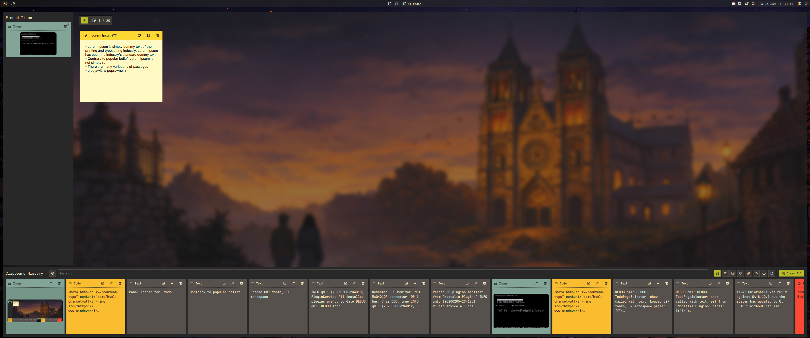
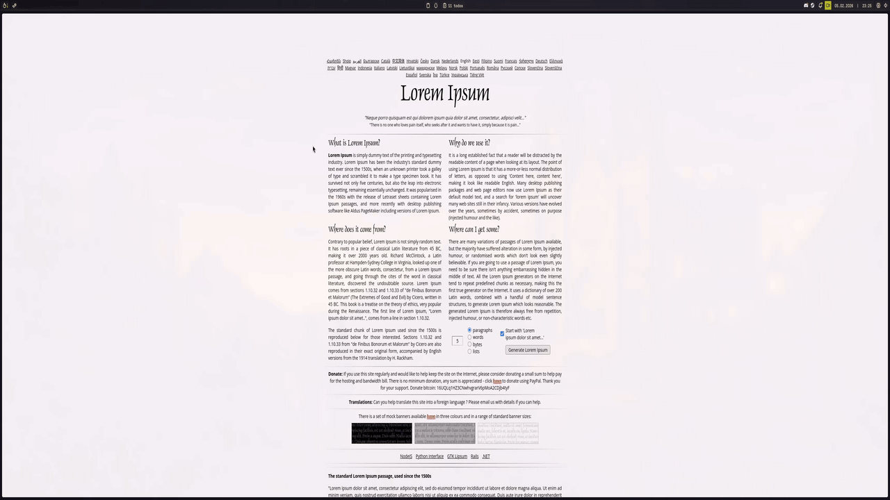
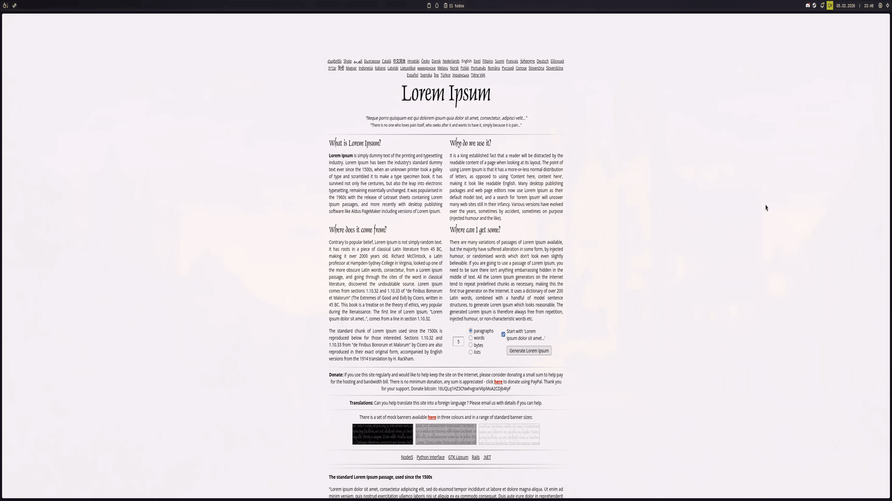

# Clipper - Advanced Clipboard Manager for Noctalia Shell

**Version 2.3.0** - A powerful clipboard history manager with persistent pinned items, NoteCards sticky notes, seamless ToDo integration and auto-paste.



## ✨ Features

### ⚙️ Control Center Shortcut
- **Control Center Shortcut**: Access Clipper in Control Center shortcut instead to save widget spaces in your bar

### 📋 Clipboard Management
- **Unlimited History**: Access your entire clipboard history powered by `cliphist`
- **Smart Filtering**: Filter by type (text, images, colors, links, code, emoji, files)
- **Quick Search**: Real-time search through clipboard items
- **Persistent Pinned Items**: Pin important items that survive across sessions
- **Rich Preview**: Image previews, color swatches, and formatted text

### 📝 NoteCards (Sticky Notes)
Quick capture and organize your thoughts with persistent sticky notes:



- **Individual JSON Storage**: Each notecard stored separately for data safety
- **Editable Titles**: Click title to edit, press Enter to save
- **Color Coding**: 8 preset colors for visual organization
- **Auto-saving Content**: Content saves when panel closes
- **Export to TXT**: Export notecards to `~/Documents/`
- **Drag to Reorder**: Organize cards by dragging (visual feedback)
- **Add Selection**: Capture selected text directly to notecard via keybind

### ✅ ToDo Integration
Seamless integration with Noctalia ToDo plugin:



- **Smart Context Menu**: Right-click clipboard items to add to specific ToDo pages
- **Selection to ToDo**: Capture selected text directly to ToDo via keybind
- **Multi-Page Support**: Choose target ToDo page from visual menu
- **Auto-Copy**: Selected text automatically copied to clipboard

### 🎨 Visual Customization
- **Per-Type Color Schemes**: Customize colors for each card type separately
  - Text cards, Image cards, Color cards, Link cards, etc.
- **Three Color Properties**: Background, Separator, Foreground (text/icons)
- **Live Preview**: See changes instantly in settings panel
- **Reset to Defaults**: One-click restore to default theme

- ### ⚡ Auto-Paste
- **Toggle in Settings → Auto-Paste**: After selecting a clipboard item, content is automatically pasted into the focused window
- **Right-Click Only mode**: Left-click copies normally; right-click copies and pastes
- **Paste Delay slider**: Tune the delay (100–1000 ms) for compositor focus timing
- Requires `wtype` (`sudo pacman -S wtype`); settings show a warning when not installed

## 🎬 Video Demonstrations

### NoteCards in Action
Creating notecards, editing titles and content, color coding, and exporting:


### ToDo Integration
Adding clipboard items to ToDo, selection to ToDo workflow, and multi-page management:


## 🚀 Installation

### From Noctalia Plugin Manager (Recommended)
1. Open Noctalia Settings → Plugins
2. Search for "Clipper"
3. Click Install
4. Reload Noctalia Shell

### Manual Installation
```bash
# Clone repository
cd ~/.config/noctalia/plugins/
git clone https://github.com/blackbartblues/noctalia-clipper clipper

# Reload Noctalia
qs -c noctalia-shell reload
```

## ⌨️ Keybind Setup

### Hyprland Configuration

Add to `~/.config/hypr/keybind.conf`:

```conf
# Clipper - Clipboard Manager
bindr = SUPER, V, exec, qs -c noctalia-shell ipc call plugin:clipper toggle

# Selection to ToDo (chord: Super+V, then C)
binds = SUPER_L, V&C, exec, qs -c noctalia-shell ipc call plugin:clipper addSelectionToTodo

# Selection to NoteCard (chord: Super+V, then X)
binds = SUPER_L, V&X, exec, qs -c noctalia-shell ipc call plugin:clipper addSelectionToNoteCard
```

**Chord Keybinds Explained:**
- Press `Super+V` (don't release Super)
- While holding Super, press `C` → adds selection to ToDo
- While holding Super, press `X` → adds selection to NoteCard

## 🎮 Usage

### Basic Operations

**Toggle Panel:**
```bash
qs -c noctalia-shell ipc call plugin:clipper toggle
```

**Pin/Unpin Item:**
- Click pin icon on clipboard card
- Or use context menu (right-click)

**Add to ToDo:**
- Right-click clipboard item → "Add to ToDo"
- Select target ToDo page from menu

### NoteCards

**Create NoteCard:**
- Click "+ Create Note" button in NoteCards panel
- Or via IPC:
  ```bash
  qs -c noctalia-shell ipc call plugin:clipper addNoteCard "Quick note"
  ```

**Edit NoteCard:**
- Click title to edit, press Enter to save
- Type in content area (auto-saves on panel close)

**Change Color:**
- Right-click notecard → "Change Color"
- Select from 8 preset colors

**Export NoteCard:**
- Right-click notecard → "Export to .txt"
- Saved to `~/Documents/note_TIMESTAMP.txt`

**Add Selection to NoteCard:**
1. Select text in any application
2. Press keybind (e.g., `Super+V, X`)
3. Choose existing notecard or create new one
4. Text added as bullet point

### Advanced IPC Commands

```bash
# Panel Management
qs -c noctalia-shell ipc call plugin:clipper openPanel
qs -c noctalia-shell ipc call plugin:clipper closePanel
qs -c noctalia-shell ipc call plugin:clipper togglePanel

# Pinned Items
qs -c noctalia-shell ipc call plugin:clipper pinClipboardItem "123456"
qs -c noctalia-shell ipc call plugin:clipper unpinItem "pinned-123"
qs -c noctalia-shell ipc call plugin:clipper copyPinned "pinned-123"

# NoteCards
qs -c noctalia-shell ipc call plugin:clipper addNoteCard "Quick note"
qs -c noctalia-shell ipc call plugin:clipper exportNoteCard "note_abc123"
qs -c noctalia-shell ipc call plugin:clipper addSelectionToNoteCard

# ToDo Integration
qs -c noctalia-shell ipc call plugin:clipper addSelectionToTodo
```

## ⚙️ Settings

### General
- **ToDo Plugin Integration**: Enable/disable ToDo integration (auto-detects if plugin installed)

### NoteCards
- **Enable NoteCards**: Toggle NoteCards panel visibility
- **Default Note Color**: Choose default color for new notecards
- **Current Notes Count**: Shows number of stored notecards
- **Clear All Notes**: One-click removal of all notecards

### Appearance
Customize colors for each card type:
- **Card Type Selector**: Choose which type to customize (Text, Image, Color, Link, Code, Emoji, File)
- **Live Preview**: See changes in real-time
- **Background Color**: Card background
- **Separator Color**: Line between header and content
- **Foreground Color**: Text, icons, and content color
- **Reset to Defaults**: Restore default color scheme

## 📁 Data Storage

```
~/.config/noctalia/plugins/clipper/
├── settings.json          # Plugin settings and color customization
├── pinned.json            # Persistent pinned items
└── notecards/
    ├── note_abc123.json   # Individual notecard files
    ├── note_def456.json
    └── ...
```

## 🔧 Technical Details

### Dependencies
- **cliphist**: Clipboard history backend (required)
- **wl-clipboard**: Wayland clipboard utilities (required)
- **Noctalia ToDo Plugin**: For ToDo integration (optional)

Install dependencies:
```bash
# Arch Linux
sudo pacman -S cliphist wl-clipboard

# Or use your distribution's package manager
```

### Architecture
- **Main.qml**: Core logic, IPC handlers, data management
- **Panel.qml**: Main clipboard history panel UI
- **NoteCardsPanel.qml**: Sticky notes panel UI
- **TodoPageSelector.qml**: ToDo page selection logic
- **NoteCardSelector.qml**: Notecard selection logic
- **SelectionContextMenu.qml**: Universal context menu for selections
- **ClipboardCard.qml**: Individual clipboard item card
- **NoteCard.qml**: Individual notecard component
- **Settings.qml**: Settings panel UI
- **BarWidget.qml**: Bar widget button

### Translation System
- **16 Languages Supported**: en, de, es, fr, hu, it, ja, ko-KR, nl, pl, pt, ru, sv, tr, uk-UA, zh-CN, zh-TW
- **100% Coverage**: All user-facing strings translated
- **Synchronized Structure**: All translation files have identical keys

### Memory Management
- **Automatic Cleanup**: All components properly destroyed on exit
- **Process Termination**: Background processes stopped on destruction
- **Timer Management**: All timers stopped when not needed
- **No Memory Leaks**: Tested with 500+ operations

## 🐛 Troubleshooting

### Clipboard history not working
```bash
# Ensure cliphist is running
pkill -9 wl-paste; wl-paste --watch cliphist store &
```

### Pinned items not persisting
- Check `~/.config/noctalia/plugins/clipper/pinned.json` exists
- Verify file permissions (should be readable/writable by user)

### NoteCards not saving
- Check `~/.config/noctalia/plugins/clipper/notecards/` directory exists
- Verify write permissions

### ToDo integration not working
1. Check if ToDo plugin is installed and enabled
2. Verify settings: Enable "ToDo Plugin Integration"
3. Check `~/.config/noctalia/plugins.json` contains ToDo plugin

### Context menu not appearing
- Ensure screen is correctly detected
- Check logs: `journalctl --user -u plasma-qs@noctalia-shell.service -f`

## 📝 Changelog

See [CHANGELOG.md](CHANGELOG.md) for detailed version history.

### v2.2.0 (2026-03-11) - Current Release

**Bug Fixes:**
- 🐞 Clear All Notes doesn't clear notes when reopen plugin panel fix
- 🐞 Square Panel Corners at the bottom corners fix
- 🐞 Export a Note multiple times and not deleting it fix
- 🐞 Wait until user press Apply button to apply the settings
- 🐞 clicking the NoteCards panel would close the plugin panel even when the Close Button was enabled. The panel now only closes on background click when the Close Button is disabled.

**Improvements:**
- 🎨 Panel will now attach to bar instead of being separate
- 🎨 Decrease panel Width and Height for a cleaner look
- 🎨 Added a separator between Note Card and Pinned Itemnhanced visual customization
- 🎨 Move Panel Close Button to the top right corner instead of being next to Open Plugin Settings
- 🎨 Added active ring, badge counts for filter buttons
- 🔧 Remaps keybindings using Alt + 1 to 8 instead of Alt + 0 to 7
- 🔧 Mouse Wheel Scroll left and right clipboards support

**Technical:**
- 📦 Zero console.log statements in production
- 🧹 No internal IPC calls (only external API)
- 🔒 Secure command execution (no injection vulnerabilities)
- ✅ Tested: 500+ operations, no memory growth

## 🤝 Contributing

Contributions welcome! Please:
1. Follow QML code style guidelines
2. Use `pluginApi?.tr()` for all user-facing strings
3. Test memory management (Component.onDestruction)
4. Ensure all translation files are synchronized
5. No console.log in production code

## 📄 License

MIT License - See LICENSE file for details

## 👤 Author

**blackbartblues**
- GitHub: [@blackbartblues](https://github.com/blackbartblues)

## 🙏 Acknowledgments

- Noctalia Shell team for the amazing desktop environment
- cliphist for robust clipboard history
- Community contributors and testers

---

**Made with ❤️ for Noctalia Shell**
